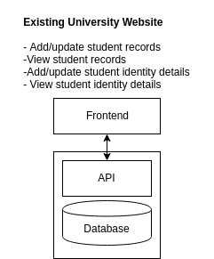
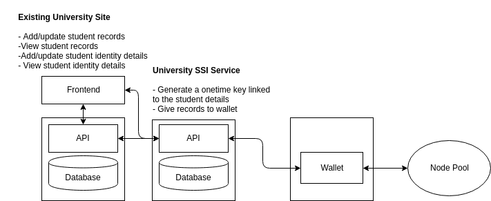
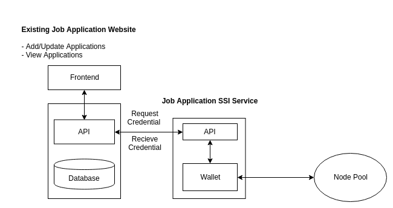
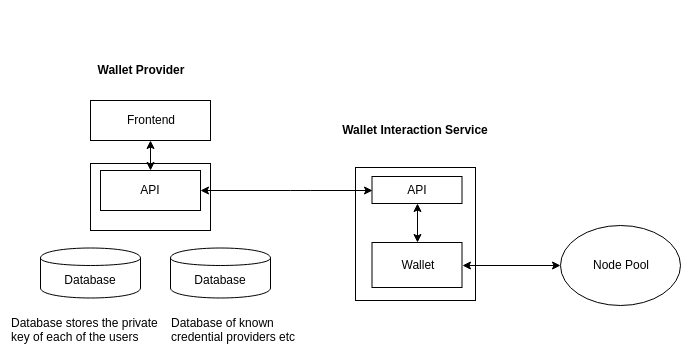

# Indy Hyperledger Self Sovreign Identity Solution POC Proposal

The following outlines at a fairly high level, a proposal for how one would go about implementing a Self Sovriegn Identy (SSI) proof-of-concept using the Indy HyperLedger framework. 

## Notes for reading this proposal

The approach I took in writing this, was thinking about the user experience first. 

In it - I assume that the when the user is applying for a job or whatever, they don't want to either manually switch to a different application, or manually fill in a form; they want to click a link, and the click 'sign in' or 'approve'. 

I have specifically gone for the concept of a 'personal wallet provider' as a website - because : 

1. Making websites is my skillset. 
2. I think websites are the best user experience and most robust, over say, a browser plugin, or native phone application. 

In writing it, I have glossed over the details of establishing a connection. But the concept I believe, still works. Essentially - the user clicks a link  that contains the information for the connection to be established, as well as about the information being requested. 

### Personal Wallet Providers

This proposal assumes that the personal wallet provider is a single monolithic type of service, like a Google or Facebook SSO, that each of the vendors (Job Application, University))would implement the interaction for specifically. 

The alternative business model is the 'personal wallet provider' is more of a spec that a multitude of organisations can implement, but then the question is how the browser knows which website to open. 

## Scope

For this, I assume that node pool is already set up, and so I don't deal with any of the architecting of Stewards or nodes. 

I also assume that a process for giving Trust Anchor status to an entity is established, though I will give some details of how this might come about. 

I also haven't addressed the setting up of credential schemas. 

### Use cases

I am going to assume that for a POC, the functionality, or a variant of,  described in [this Indy Hyperledger](https://github.com/mwherman2000/indy-gsg-ea/blob/master/python/doc/getting_started-enterpise.md) documentation will be implemented.  

In this document I'm just going to focus on Alice getting the credential from her academic institution, and Alice asserting that credential to a job application site. 

 ## Security / Do users own their own private key? 

In the examples I give, I assume that organisations are managing their own wallets and private key. 

I assume that individual users are not - they are using a managed idenity service, https://mypersonalwallet.example.com. 

The interact with this service via a web browser, which they access with a username and password. 

 ## User Experience

 At its core, this proof of concept could be a series of users writing code or command line actions to request a transcript, release it to another entity etc. 

 However, this wouldn't be particularly useful, as the intention if this technology to be easy to use for the lay person. 

 The following describes how I invision some key interactions going: 

 ### Alice applies for a job

 1. Alice goes to the job application website MyJobWebsite
 2. The website has button that says 'click here to assert your academic credential'
 3. The button opens a new tab to https://mypersonalwallet.example.com?request=someencodedrequesthere
 4. If Alice is not logged in, it prompts her to log in. 
 5. If Alice is logged in, the request is decoded with an assertion screen that shows: 
    - She is going to make a credential assertion to MyJobWebsite
    - There is a dropdown to select which credential she is going to assert
    - If she hasn't already got a credential, she can do that from here. 
 6. Once she submits the form, the tab closes and she goes back to the job website, where she can see that the credential has been recieved. 

 ### Requesting a credential

 Alice can request a credential in three ways. 

#### Option 1a - Via Government Asserted identity from University Website

 1. She goes to her university website MyUniversityWebsite
 2. The website has a button that says 'click here to request your academic credential'
 3. The button opens a new tab to https://mypersonalwallet.example.com?request=anotherencodedrequest
 4. If Alice is not logged in, it prompts her to log in. 
 5. If Alice is logged in, the request is decoded with an assertion screen that shows: 
    - She is going to request a credential from MyUniversity
    - She needs to assert her DOB, Name, etc from MyGovernmentIdentityProvider
 6. Alice clicks submit and sees that her academic creditial is available on her list of credentials. 

#### Option 1b - Via Government Asserted identity from Wallet Website

1. Alice navigates to https://mypersonalwallet.example.com
2. Alice logs in with her username and password
3. Alice clicks 'Add credentials'
4. Alice searches 'MyUniversity'
5. Alice sees a assertion screen that shows: 
    - She is going to request a credential from MyUniversity
    - She needs to assert her DOB, Name, etc from MyGovernmentIdentityProvider
6. Alice clicks submit and sees that her academic creditial is available on her list of credentials. 

#### Option 2a - Via traditional identity document. 

1. Alice goes to the Student Help Desk at her university
2. She presents her passport as proof of identity
3. The university texts/emails her an address https://mypersonalwallet.example.com?request=anotherencodedrequestwithaonetimecode
4. If Alice is not logged in, it prompts her to log in. 
5. If Alice is logged in, the request is decoded with an assertion screen that shows: 
    - She is going to request a credential from MyUniversity
    - She needs to assert a one time code - which is already filled in. 
6. Alice clicks submit and sees that her academic creditial is available on her list of credentials. 

#### Option 2b - Via existing verified student identity

1. Alice navigates to MyUniversityWebsite
2. She logs in with her university username and password
3. The website has a button that says 'click here to request your academic credential'
4. The button opens a new tab to https://mypersonalwallet.example.com?request=anotherencodedrequest
5. If Alice is not logged in, it prompts her to log in. 
6. If Alice is logged in, the request is decoded with an assertion screen that shows: 
    - She is going to request a credential from MyUniversity
    - She needs to assert a one time code - which is already filled in. 
7. Alice clicks submit and sees that her academic creditial is available on her list of credentials. 

## Architecting - High Level - Use Microservices

I recommend developing this as a series of microservices.

### Organisations

For organisations - we assume that the organisations already have a tech stack with database, web apis etc. 

For the proof-of-concept, these will need to be created, but we will create these seperately. 

#### University 

In the example of the University, the interaction with the Ledger is essentially _read only_ of the universities data. ie. Unlike the Job Website, we aren't going to update any existing data based on the Ledger interaction. 

However, we do need some kind of backend for validating the one time codes. 

Here, I propose creating a seperate API microservice that will interact with the existing API to retrieve records. It will also have a database for storing the onetime codes (or it could store them in memory, that would be simpler). 

In this case, when the wallet recieves a credential request, the wallet makes a call to the SSI API, and then acts according to the response. 

The University's wallet, would be stored on its own microservice. 

**Why not have the wallet be part of the SSI service?**

In the example given, that might be ok. But in practise, the systems might be more complicated, and you might have multiple API microservices that interact with the  wallet. 

#### Job Applications

The job application site SSI service doesn't need its own database - as it is just making calls to the existing job application API to update the application. 

In this case, when the wallet recieves a credential request, the wallet makes a call to the SSI API, and then acts according to the response.

### Personal Wallet Provider

The Personal Wallet Provider is responsible for: 

 - Securing the user's wallet PK behind a username and password
 - Decoding the query params into a specific connection and credential request . 
 - If the user chooses to continue, it establishes the connection, and then makes the credential assertion. 
 - The personal wallet provider would also preemptively search out vendors who are using the SSI concept - so rather than having to go to their website and to integrate with it, the user can search that vendor from the wallet provider. 

## Architecting - Details and Platform 

I recommend using Docker as the containerization platform. It is very popular, has good community support and good cloud support. 

### Hosting

I am generally in favour of using Kubernetes as a container orchestration platform, because it is cloud agnostic. The problem with going native with a major cloud provider, is that you will need to rewrite your code if you want to change provider. 

Whereas with Kubernetes, you just need to set your cluster up on the cloud provider, and it should keep running. 

However, the configuration of a Kubernetes cluster can be a fiddly and time consuming affair (eg. setting up TLS certificates), and really wants to have a dedicated person who can help do all of that. So if that kind of resource is not available, for a smaller, shorter time frame type project, I would recommend using Heroku - which is easy enough to deploy containers to, and is easy enough to set up as microservices, if not comparitively more expensive ($US7 per service per month). 

It should be pointed out that for this proof of concept, you have three seperate entities (The University, The Job Application Site, and the Personal Wallet Provider), in the real world, each of these would be maintaining their own operational environment. 

## Summing Up

I would identify three areas of generic functionality. 

These should be created as templates that can cloned and modified to achieve different business purposes. 

- Creating 'legacy' POC applications. (ie. applications pre-hyperledger integration). 

   - For these, I would use a standard React/Node/Mongo (mLab) on a Docker container on Heroku/other cloud provider

- Creating middleware API layer. 
   - I would use Node on a Docker container running on Heroku/other cloud provider. 

- Creating the wallet agents

   - I would use either the Node Indy SDK or the Python Indy SDK, running on a docker container on Heroku/other cloud provider. 

